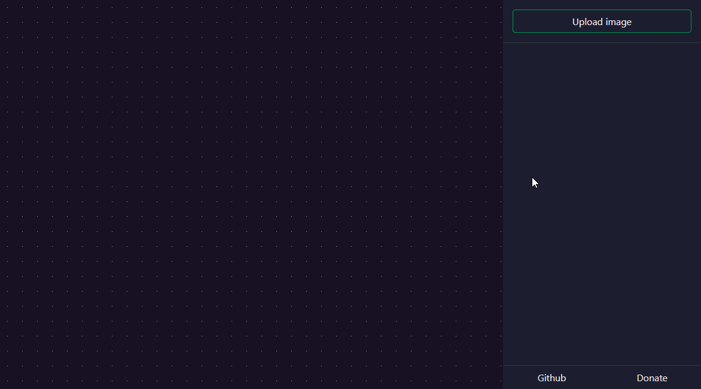

# Slice

A fast and easy collaboration cropping tool

## Introduction

Slice is a tool made with the intention of making it easy to make crops for social media profile picture collaboration.
There are tools out there that make it easy for singular profile pictures, but this project intends to make it easier in
cases of two or more profiles. The intended purpose for the cropped images are profile pictures, and because of that,
it will only allow square crops.

## Motivation

As for personal reasons, this is my first ReactJS project. Due to that the code might be absolutely atrocious. Help is 
also welcome!

## Features

* Select any JPG/PNG image to crop
* Add different profiles that can be cropped respectively
* Get a preview of your crops, both square and circular previews
* Download your cropped images!

## Getting started

### Installing dependencies

`npm install`

### Usage

`npm start`

## Preview

